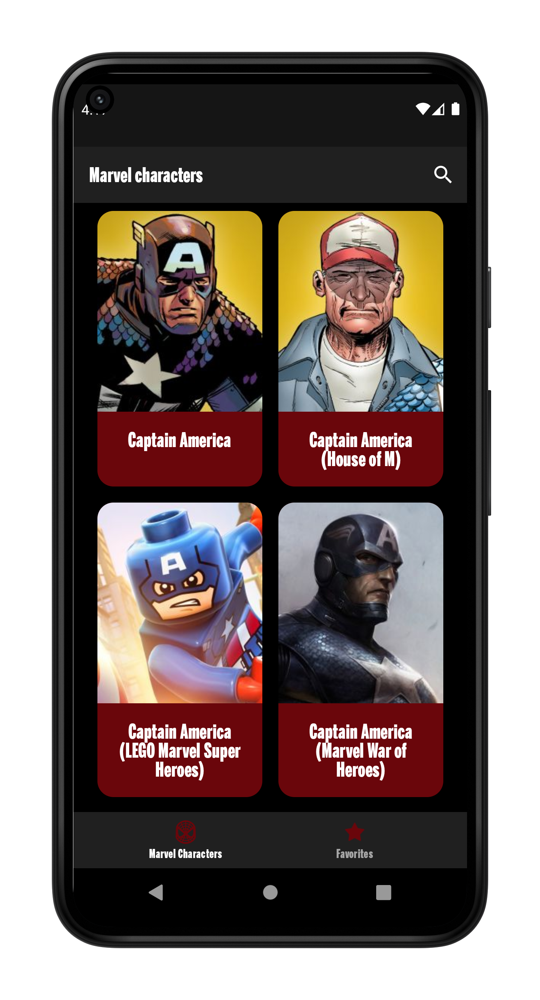

# Marvel Characters Android App

## Introduction 🎉

This is a sample app using [Marvel API](https://developer.marvel.com/) and a place where to apply
good development principles and play with libraries, etc. in a real Android project.

## Getting Started 🚀

The project requires access to the Marvel API. To get this access you can register by free
in [Marvel API](https://developer.marvel.com/)
to get a private key and an API key.

## Running the project ✈️

To run the project a `secrets.xml` file placed in `main/src/values` folder is needed. This file has
the values obtained after register in [Marvel API](https://developer.marvel.com/). You can see these
values in your [account settings](https://developer.marvel.com/account).

The content of the `secrets.xml` file is the next:

```xml

<resources>
  <string name="private_key">PRIVATE_KEY</string>
  <string name="api_key">API_KEY</string>
</resources>
```

## Architecture 📐

The design of this app is based on Clean Architecture though MVVM(Model-View-ViewModel),

The used layers are described below:

* **data**: This is the infrastructure layer where external implementations to my domain goes, they
  are the 'adapters'; like repository implementations, data sources, etc.
* **di**: The dependency injection layer (based on Hilt)
* **domain**: Here is where the logic of the app goes, such us: models, repository interfaces,
  custom network management
* **ui**: The layer responsible for the UI interactions

Moreover, some Android instrumented tests have been created
in [src/androidTest/java/ivansantos/marvelcharacters/ui](./app/src/androidTest/java/ivansantos/marvelcharacters/ui)
folder.

## App screenshots 📷



---
Made with ❤️and ☕ by [Iván Santos](https://github.com/IvanSantosGonz)
